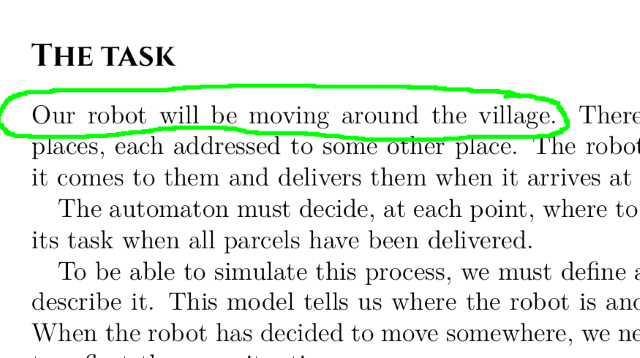

# InkExtrakt
When reading PDFs on my mobile or tablet, I often find myself wanting to highlight specific words or sections that capture my attention. I want to do it quickly so as not to break my flow, So I use free hand annotation to underline these words. Unfortunately, I found out that these hand-drawn highlights tend to get lost easily, making it worthless to take notes in the first place. So I'm trying to solve this problem with this application.


## Features 
- extract words that are underlined using free hand highlighter into organized file.

## Installation

Make sure you have [Poetry](https://python-poetry.org/) installed. Then, navigate to the project directory and run the following command to install the project dependencies:

```shell
poetry install
```

## Usage

To extract freehand annotations from a PDF file, run the following command:

```shell
poetry run python main.py >
```

Make the PDF files you want to extract freehand annotations from are in the same folder as `main.py`

The extracted annotations will be saved in a Markdown file with the same name as the PDF file, under a folder named "Annots - `<pdf_file_name>`".

## Project Structure

The project follows the following structure:

```
freehandextractor/
  ├── main.py
  ├── annotationwriter.py
  ├── pdfextractor.py
  ├── README.md
  └── pyproject.toml
```

- `main.py`: The entry point of the application.
- `annotationwriter.py`: class responsible for writing the extracted annotations to a Markdown file.
- `annotationextractor.py`: class responsible for extracting freehand annotations from the PDF.
- `README.md`: The project's README file.
- `pyproject.toml`: The Poetry configuration file specifying the project name, dependencies, and other settings.

## Issues & Future 
- This project work now on text based Pdfs, NO ocr supported
- Right Now I can't determine the line height of the document automatically resulting into either getting more lines above if the line is too high or no thing at all. So You may adjust it manually in `AnnotationExtractor`
```python
class AnnotationExtractor:
    def __init__(self, doc):
        self.doc = doc
        self.line_height = 20 # put your value here
```
- In the future I may consider this usecase 
## Contributing

I really appreciate your feedback. I don't even know if this problem is related to someone else or it's just me. 


